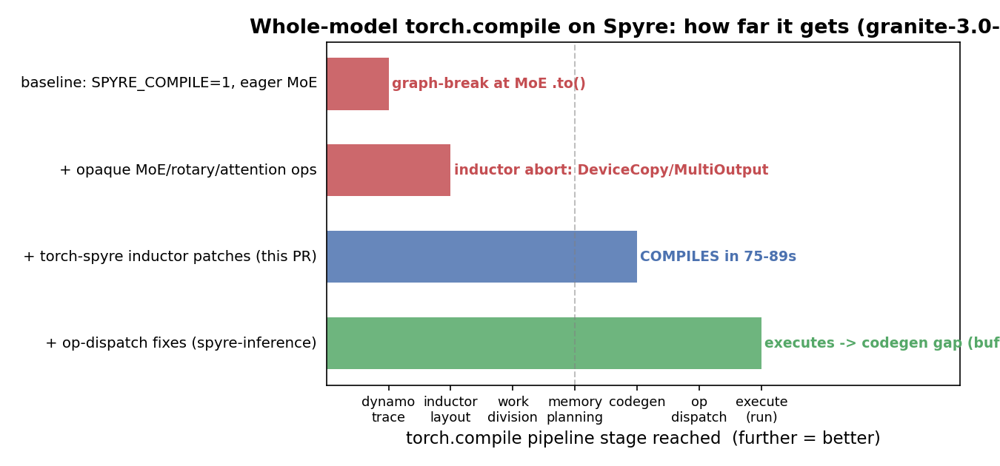

# Whole-model `torch.compile` enablement — eval

These three inductor-pass fixes let a whole vLLM model whose CPU-fallback ops are
wrapped as **opaque custom ops** (`spyre_convert`, opaque rotary, opaque attention,
and the `spyre_fused_moe` MoE op) pass the Spyre inductor pipeline instead of
aborting. Measured on `ibm-granite/granite-3.0-1b-a400m-instruct` via
`spyre-inference` with `SPYRE_COMPILE=1`, torch-spyre rev `2cb9f2a`.

## How far whole-model compile reaches



| Config | Last pipeline stage reached | Outcome |
|---|---|---|
| `SPYRE_COMPILE=1`, eager MoE | dynamo trace | graph-break at MoE `.to()` — `fullgraph=True` fails |
| + opaque MoE / rotary / attention ops | inductor layout | **abort**: `FallbackKernel must be followed by MultiOutput`; unhandled `DeviceCopy` |
| **+ torch-spyre inductor patches (this PR)** | **codegen** | **compiles end-to-end in 75–89 s** |
| + op-dispatch fixes (spyre-inference side) | execute | runs into a codegen gap (`NameError: buf31`) |

**Before this PR**, whole-model compile aborts in the layout pass — no model of
this shape compiles. **After**, `granite-3.0-1b` clears layout → work-division →
memory-planning → codegen and produces a compiled artifact (measured
`LOADED+COMPILED in 88.8s`).

## What each fix unblocks

- **`propagate_layouts.py` / `work_division.py`** — both assumed every
  `FallbackKernel` is immediately followed by a `MultiOutput` and raised otherwise.
  Single-output opaque ops have no trailing `MultiOutput`; the passes also had no
  case for `DeviceCopy` nodes (host↔device transfers emitted for CPU-fallback ops).
  Fixed to handle `FallbackKernel` / `MultiOutput` / `DeviceCopy` without assuming
  the pairing.
- **`memory_planning.py`** — `get_buffer()` can return a `TorchBindObject` (the
  attention op's script-object argument), which has no `get_layout()`. Skipped like
  `Symbol`.

## Known limitation (WIP toward full execution)

These patches get the graph **through** the passes; they do **not** add full
`DeviceCopy` / `MultiOutput` **codegen**. The generated wrapper for the mixed-device
graph currently leaves a dangling buffer reference (`NameError: buf31`). Closing
that — real buffer allocation + emission for the transfer/multi-output nodes, plus
on-device kernels for the last aten ops that leak into the graph
(`_index_put_impl_`, …) — is the remaining work to run the compiled model.

## Reproduce

```bash
# in spyre-inference, with this torch-spyre rev installed:
SPYRE_COMPILE=1 python run_moe.py   # granite-3.0-1b, enforce_eager=False
# without this PR: aborts in propagate_layouts
# with this PR:    "LOADED+COMPILED in ~80s", then the buf31 codegen gap
```
